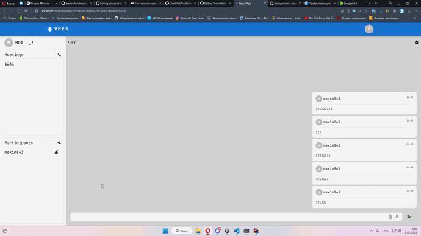

<h1 align="center">VMCS Backend - Video Messenger With Code Sharing</h1>
<h2 align="center">

</h2>

<h2><a href="https://github.com/alexxykv/vmcs-frontend">Frontend</a> - https://github.com/alexxykv/vmcs-frontend</h2>

## Цель

Создать видеомессенджер с возможностью совместного редактирования кода.

<h2 align="center">

</h2>

## Описание

Web/Desktop приложение для __общения__ двух и более человек по видео и аудио связи, показом экрана, а также с возможностью __совместного редактирования кода__, с возможностью загрузки или создания проекта, и последующим сохранение его в виде архива или удаленного репозитория на гитхаб.

## Используемые технологии

* __C#__
* __Asp.net__
* __SignalR__
* __PostgreSQL__
* __Docker__
